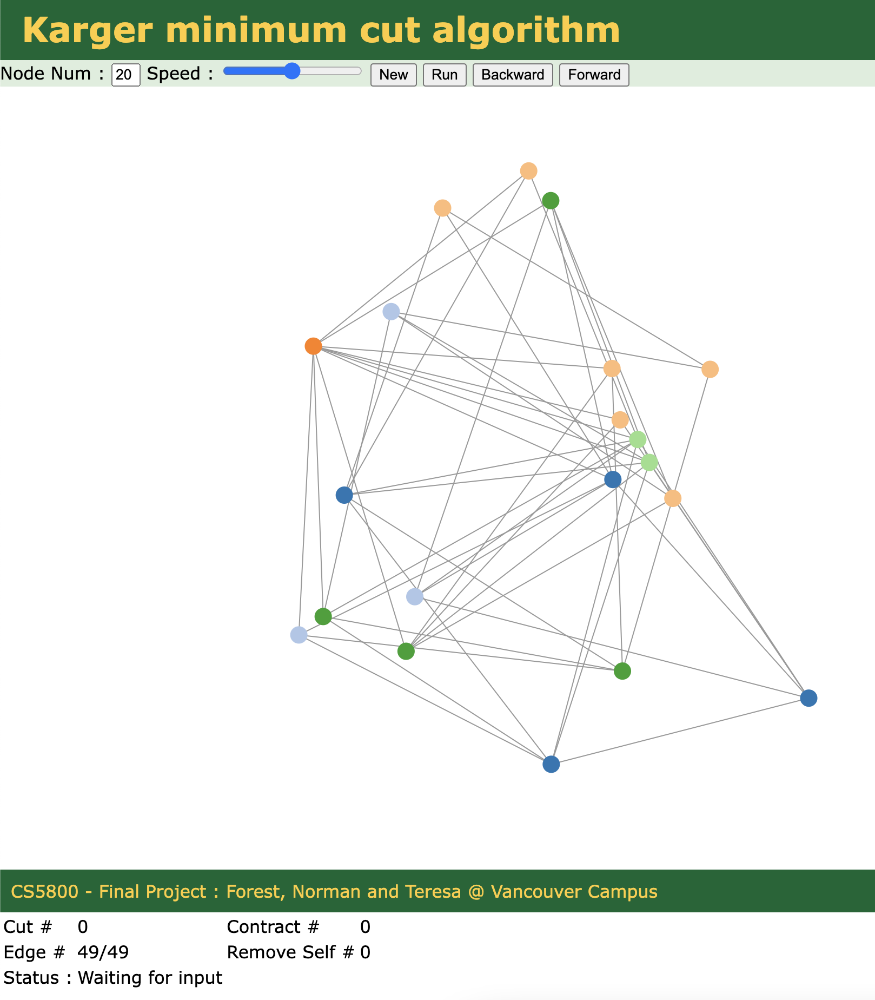

# CS5800 Project



[Live Demo on Heroku](https://karger.herokuapp.com/)

# Installation
1) Development version:

```bash
npm install
npm start
```

2) Docker Version
```
# Build the Docker Image
docker build . -t karger

# Run Docker [Clean up after terminated]
docker run --rm -p 8080:8080 --name karger karger
```
